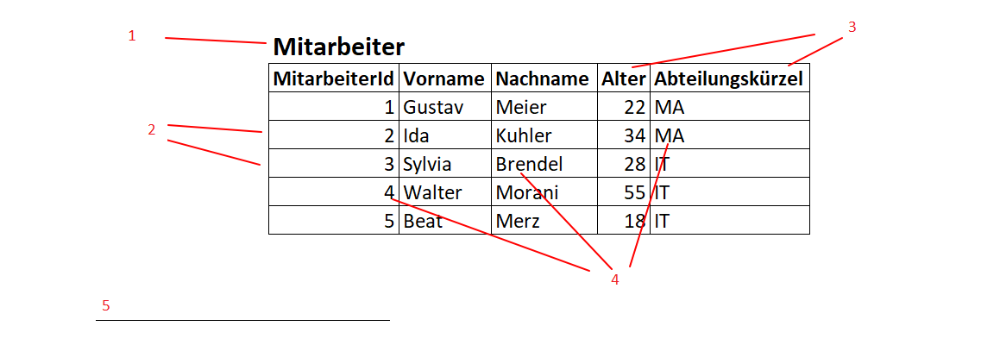
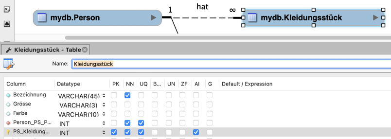

# Modul_164

## Recap Modul 162: Allgemein
 
**1. Welche Stufen gibt es bei der Wissenstreppe?**
**Nennen Sie diese der Reihe nach und machen Sie ein Beispiel mit einem Wechselkurs.**
- Zeichen
- Daten
- Information
- Wissen
- Handeln
- Kompetenz
- Wettbewerbsfähigkeit
 
**2. Wie werden Netzwerk-Beziehungen im logischen Modell abgebildet?**
 
Es gibt Relationen zwischen Tabellen. Die Relationen sind 1:1, 1:n und n:m. Sie haben Primär- und Fremdschlüssel.
 
**3. Was sind Anomalien in einer Datenbasis? Welche Arten gibt es?**
 
Anomalien sind unerwünschte Nebeneffekte bei der Datenverarbeitung.
 
Einfügeanomalie: Daten können nicht eingefügt werden.
Löschanomalie: Beim Löschen gehen ungewollt Daten verloren.
Änderungsanomalie: Daten sind inkonsistent nach einer Änderung.
 
**4. Gibt es redundante "Daten"? Warum?**
 
Ja, wenn Informationen mehrfach gespeichert werden.
Führt zu Inkonsistenzen und Platzverschwendung.
 
**5. Datenstrukturierung bei der Erhebung und Ablage von Daten:**
**Welche zwei Aspekte können strukturiert werden?**
**Welche Kategorien (Abstufungen) gibt es bei der Strukturierung?**
**Und wie müssen die Daten in einer DB strukturiert sein?**
 
Zwei Aspekte: Inhalt und Zugriff.
Kategorien: unstrukturiert, semistrukturiert, strukturiert.
DB-Struktur: Daten müssen normalisiert und in Relationen aufgeteilt sein.
 
**6. Beschreiben das Bild mit den richtigen Fachbegriffen**

 
1. Entität
2. Primärschlüssel
3. Attribut
4. Attributwert (Datensatz)
 
**7. Welche (einschränkenden) Einstellungen zu den Attributen (z.B. ID) kennen Sie?**

 
Primärschlüssel: Eindeutigkeit (Darf nur einmal vorkommen)
Fremdschlüssel: Referenz auf andere Tabelle
NOT NULL: Wert muss vorhanden sein
UNIQUE/Redundanz: Keine doppelten Werte

## Recap Modul 162: Normalisierung

## Drei Arten von Datenmodellen

1. **Konzeptionelles Modell (ERM):**  
   - Fachlich, ohne Technik  
   - Aus den Anforderungen

2. **Logisches Modell (ERD):**  
   - Fachliches Modell + technische Infos (z. B. Schlüssel)

## Modellformen je nach Einsatz

- **3NF:** für Eingabesysteme (z. B. ERP)  
- **Star Schema:** für Auswertungen (z. B. Reporting)  
- **Data Vault:** für flexible und automatisierte Systeme

# Normalisierungsschritte (einfach erklärt)

1. **1NF:**  
   - Keine mehrfachen Werte in einem Feld (alles atomar)

2. **2NF:**  
   -  Jedes Datenfeld hängt vom gesamten Primärschlüssel ab

3. **3NF:**  
   -  Keine Abhängigkeit zwischen Nicht-Schlüssel-Feldern